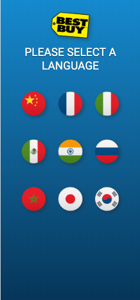
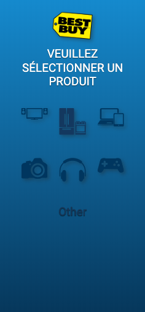
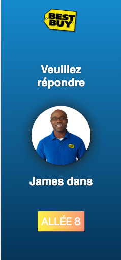
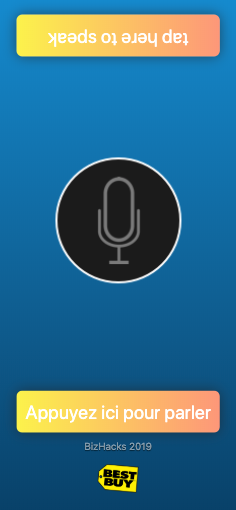
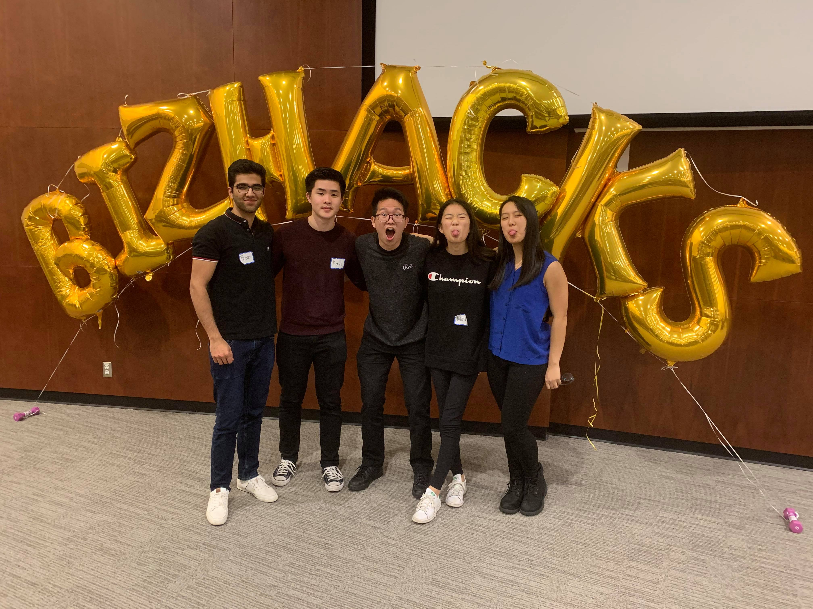

# Bizhacks 2019

BestVoice is a mobile web app designed to provide Best Buy customers with a personalized and optimized in-store experience. Our team targeted a major demographic within Vancouver by trying to alleviate the language barrier that immigrants experience. Through BestVoice, non-English speakers can use a smart phone to ask questions and have a conversation with Best Buy employees in their own languages. Our demo can be reached through this **link:** https://pranavnarang.github.io/bizhacks2019.github.io/

## Instructions:

Simply follow these steps to ask questions in your own language:

1. Select a language you want to speak in
2. Select a product category which you have questions about
3. You will then be prompted to meet a Best Buy representative at aisle #
4. Once you are with the Best Buy representative, simply tab the bar to start speaking in your own language

## Demo:

Here are screenshots of a step-by-step tutorial:

**Step 1:**

**Step 2:**

**Step 3:**

**Step 4:**

## Tech/framework used:

Built with:

- HTML
- CSS
- Bootstrap
- JavaScript

APIs used:

- API for converting voice to text
- API for translating text
- API for converting text to speeching

## My responsibilities:

Among a team of 5 members, I was responsible for integrating the 3 APIs together. Without the financial support, our team decided not to utilize Google Translate in our project. In order to translate, I had to first convert the speech of the user to a text. The text would then be translated into another text in the language of the recipient. Finally, the text of the recipient would then be converted into a speech for the recipient to hear. Additionally, I was also responsible for creating front-end components using HTML and style them using CSS and Bootstrap.

## Credits:

Without my amazing team, BestVoice would always be just an idea. We all worked so hard and slept for 2-3 hours to make sure that we deliver our demo to the judges and the audience. Each team member had a role and by working together we were qualified for the Final round and received 5th place among 44 teams!

